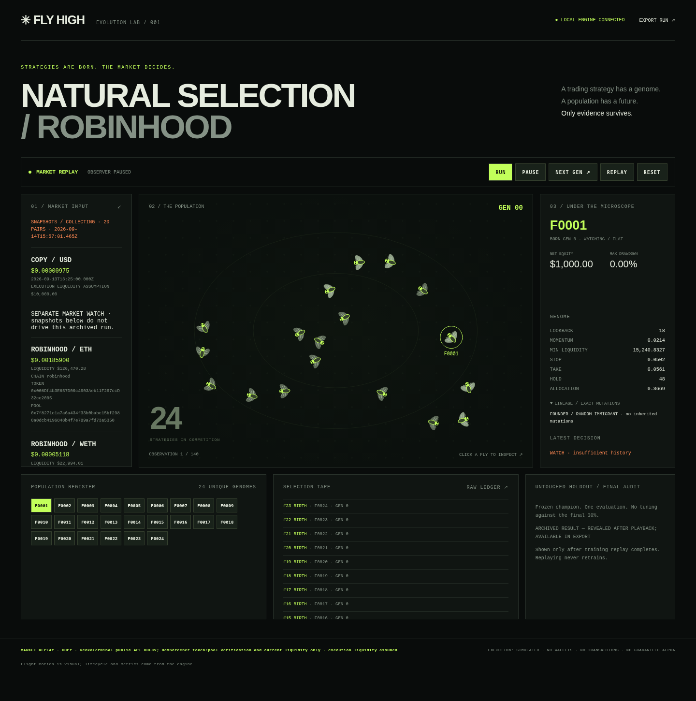

# FLY HIGH

**Strategies are born. The market decides.**



A local, inspectable evolutionary paper-trading lab. Each fly carries a bounded strategy genome: momentum, lookback, liquidity threshold, stop, take-profit, holding period and allocation. Strategies compete on training data; survivors reproduce, mutations create new lineages, and an immigrant preserves exploration. A frozen champion faces an untouched chronological holdout.

No wallet connection. No private keys. No live orders. Python standard library; no package install or API key required for the offline lab.

## Public Railway replay

The Dockerfile starts `python -m flyhigh.server --public`, binding **0.0.0.0**
on Railway's `PORT` (8080 in the image). Public mode loads
`examples/copy.report.json` by default, without rerunning evolution or using an API.
The container uses only Python's standard library and runs as an unprivileged user.

Set `FLYHIGH_ALLOWED_HOSTS=flyhigh.fun` in the Logics Railway service. This is an
exact, comma-separated Host allowlist, not suffix matching; do not include schemes,
paths or wildcards. `RAILWAY_PUBLIC_DOMAIN`, when Railway supplies it, is automatically
added. Attach `flyhigh.fun` to that service and configure DNS using Railway's displayed
record. Railway terminates TLS; do not expose the Python origin directly to the Internet.
These are deployment instructions, not a claim that deployment or DNS is complete.

Each browser tab owns its playback cursor and run/pause/reset/replay/next-generation
controls. No cookies, server sessions, shared public controls, live collector, orders,
or continuous evolution are involved. Refresh resets that tab. Playback stops at the
end of the fixed archive. Historical prices are authentic; execution liquidity remains
an explicit assumption. Exports contain the already computed holdout.

Public POSTs require an exact **HTTPS same Origin** and are then rejected with 405:
all playback controls are browser-local. Other/missing origins return 403. Host checks
apply to every served route, including `/healthz`. Requests have a 10-second socket
inactivity timeout; browser fetches abort after 15 seconds. The stdlib origin should
remain behind Railway's edge; it is not a standalone hardened Internet HTTP server.
If enabling Railway health checks, ensure its probe Host is explicitly allowed (Railway
may use `healthcheck.railway.app`); add only that exact host to the environment allowlist.

Local deployment smoke check:
```sh
PORT=8080 FLYHIGH_ALLOWED_HOSTS=flyhigh.fun python3 -m flyhigh.server --public
# In another shell:
curl -H 'Host: flyhigh.fun' http://127.0.0.1:8080/healthz
```

## Run the lab

Requires Python 3.10+; Node.js 18+ only for motion tests.

```sh
python3 -m flyhigh.server
```

Open **http://127.0.0.1:8765**. The default visual lab uses a **seeded synthetic fixture**, not historical market prices. Run/pause/reset/replay controls change playback, not the source of the data. The collector is separate and must be started explicitly.

## Replay authentic Robinhood-chain prices

The checked-in dataset contains **351 completed 5-minute OHLCV candles**: COPY 200, HOPOUT 102, GPTHEIST 49. These are actual saved GeckoTerminal API responses with DexScreener chain/base-token checks, source URLs, timestamps and SHA-256 provenance. See [source notes](examples/PROVENANCE.md) and [request manifest](examples/provenance.json).

**Historical liquidity is unavailable.** The importer requires a deliberate, explicitly labelled execution-liquidity assumption. It never substitutes today's liquidity snapshot or candle volume for historical depth.

```sh
python3 -m flyhigh.import_history --input examples/canonical.json --symbol COPY --assumed-liquidity 10000 --output data/copy.report.json
```

This runs the real prices through the engine, records the scenario in the report, and prints measured results. The assumed USD 10,000 is an arbitrary demonstration parameter, **not a market measurement**. Source candle timestamps are interval starts; the adapter moves closes to interval end before exposing them to the strategy. Gaps are retained. The historical runner sets the maximum gap to one 300-second interval. Do not feed this dataset through the generic server `--input`: it expects observed `timestamp,price,liquidity` rows and uses a 180-second default gap.

Open the authentic-price report in the same browser terminal, without rerunning selection:

```sh
python3 -m flyhigh.server --load-report data/copy.report.json
# Or use the checked-in reproducible report directly:
python3 -m flyhigh.server --load-report examples/copy.report.json
```

The holdout is computed before playback and available in the exported report. The UI reveals it after playback for presentation; this is not an access-control barrier. Replay never retrains.

### Checked-in COPY result (seed 17)

See [full reproducible report](examples/copy.report.json). With 24 flies, six generations and 140 training / 60 holdout observations:

| Holdout strategy | Return | Fills |
|---|---:|---:|
| Frozen champion F0011 | 0.0000% | 0 |
| Random entry baseline | +0.9154% | 3 |
| Fixed momentum baseline | -1.9935% | 2 |

Champion holdout drawdown and fees are both zero because it never traded. Its training result is not evidence of alpha. Sparse observations can prevent signal windows and cancel pending fills; no missing candles are fabricated. Baseline returns are hypothetical too.

## Collect prospective observations

```sh
# One public DexScreener snapshot (network required)
python3 -m flyhigh.collector --directory data
# Repeated snapshots, no historical backfill
python3 -m flyhigh.collector --directory data --watch --interval 60
# Export one exact pair after collecting enough observations
python3 -m flyhigh.collector --directory data --pair YOUR_PAIR_ADDRESS --output data/observations.json
# Replay genuine observed price + liquidity snapshots
python3 -m flyhigh.server --input data/observations.json --report data/observed.report.json --no-server
```

The snapshot search is limited to provider results matching `chainId=robinhood`; it is not a comprehensive token discovery service. Empty results and provider errors remain visible and never trigger substitution from another chain or synthetic data. At least 80 observations are needed for evolution. No historical backfill is claimed by this collector.

## Verify

```sh
python3 -m unittest discover -s tests -v
node --test tests/*.test.js
```

CI runs both commands. Tests cover chronological validation, next-observation execution, gaps, costs, deterministic evolution, lineage, collector identity filtering, server controls/origin checks, the OHLCV adapter and distinct motion.

## Project map

- `flyhigh/engine.py`: deterministic evolutionary search and simulated execution.
- `flyhigh/data.py`: strict observed-bar validation and explicit synthetic fixture.
- `flyhigh/import_history.py`: authentic OHLCV scenario replay.
- `flyhigh/collector.py`: prospective public snapshots and single-pair export.
- `flyhigh/server.py`, `web/`: loopback lab and explicit read-only public replay.
- `examples/`: canonical history, raw receipts, provenance and computed COPY replay.
- [Methodology](docs/METHODOLOGY.md): assumptions and failure modes.

MIT-licensed code, copyright Logics. Third-party market data remains subject to its providers' terms. Research software, not investment advice or production execution infrastructure.
